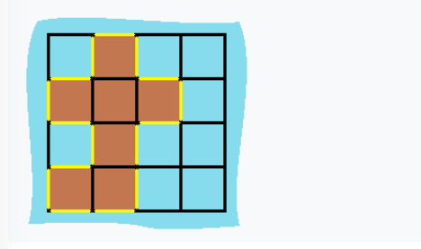

You are given a map in form of a two-dimensional integer grid where 1 represents land and 0 represents water.

Grid cells are connected horizontally/vertically (not diagonally). The grid is completely surrounded by water, and there is exactly one island (i.e., one or more connected land cells).

The island doesn't have "lakes" (water inside that isn't connected to the water around the island). One cell is a square with side length 1. The grid is rectangular, width and height don't exceed 100. Determine the perimeter of the island.

 

Example:

Input:
[[0,1,0,0],
 [1,1,1,0],
 [0,1,0,0],
 [1,1,0,0]]

Output: 16

Explanation: The perimeter is the 16 yellow stripes in the image below:

