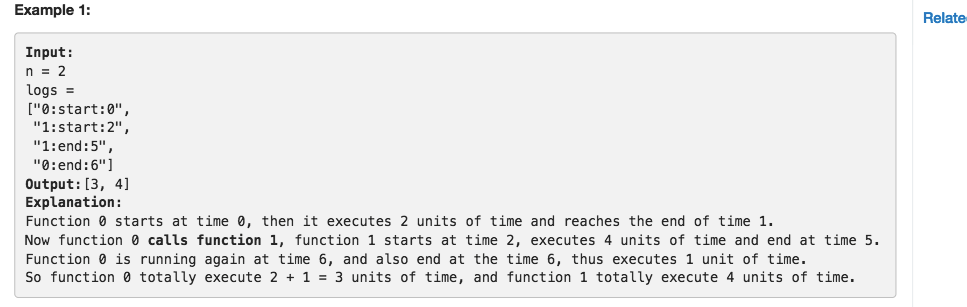

### 636. Exclusive Time of Functions
Given the running logs of n functions that are executed in a nonpreemptive single threaded CPU, find the exclusive time of these functions.

Each function has a unique id, start from 0 to n-1. A function may be called recursively or by another function.

A log is a string has this format : `function_id:start_or_end:timestamp`. For example, `"0:start:0"` means function 0 starts from the very beginning of time 0. "0:end:0" means function 0 ends to the very end of time 0.

Exclusive time of a function is defined as the time spent within this function, the time spent by calling other functions should not be considered as this function's exclusive time. You should return the exclusive time of each function sorted by their function id.

Note:

* Input logs will be sorted by timestamp, NOT log id.
* Your output should be sorted by function id, which means the 0th element of your output corresponds to the exclusive time of function 0.
* Two functions won't start or end at the same time.
* Functions could be called recursively, and will always end.
* 1 <= n <= 100
